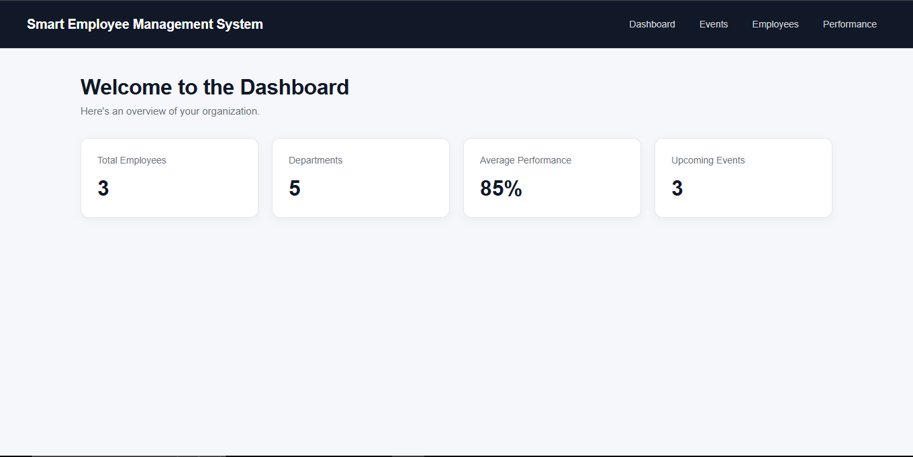
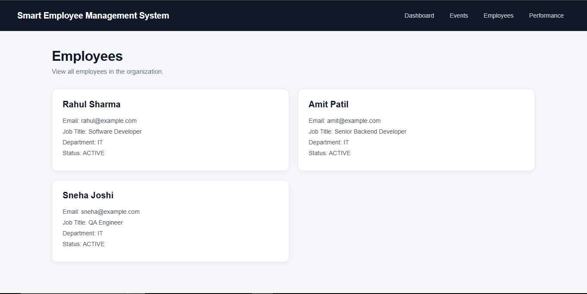
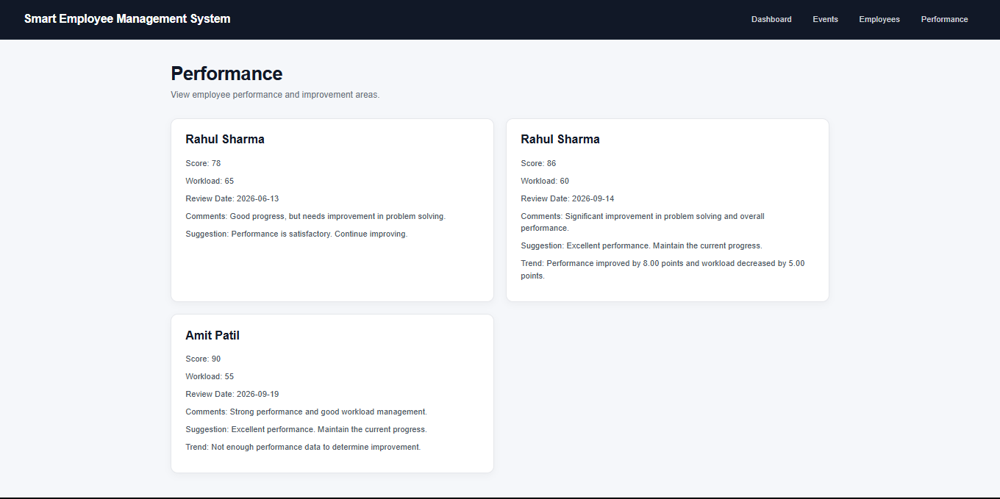
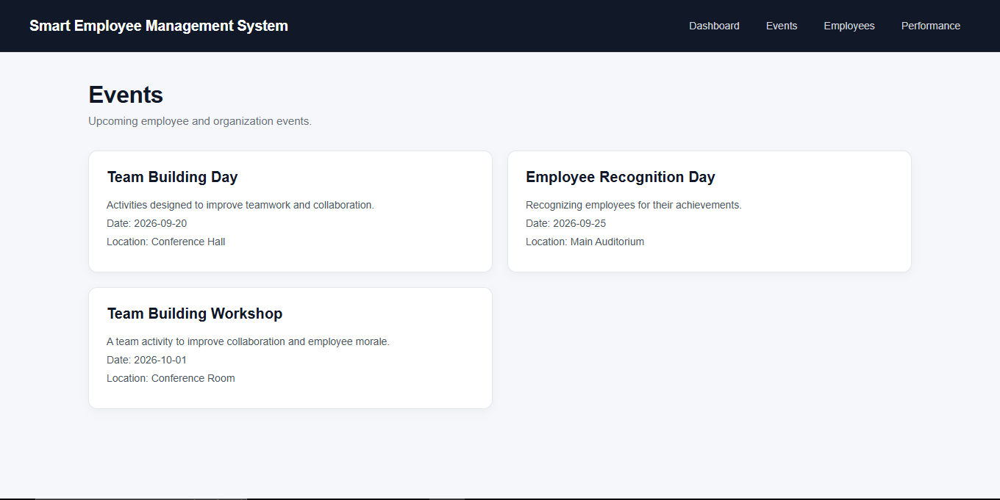

# Smart Employee Management System

A full-stack employee management platform designed to help HR teams manage employee information, monitor performance, identify improvement areas, and organize employee engagement events.

## Project Overview

The Smart Employee Management System provides a centralized platform for managing employee information and performance data.

The system allows HR teams to:

- View employee information
- Organize employees by department
- Track employee performance
- View performance history and trends
- Get performance-based improvement suggestions
- Manage employee and organization events
- View important organization statistics through a dashboard

## Key Features

### 📊 Dashboard
Provides an overview of the organization with:

- Total employees
- Total departments
- Average performance
- Upcoming events

### 👥 Employee Management
Displays employee information including:

- Name
- Email
- Job title
- Department
- Employment status

### 📈 Performance Management
Allows HR teams to view:

- Employee performance scores
- Workload
- Review dates
- Performance comments
- Improvement suggestions
- Performance trends based on previous reviews

### 📅 Event Management
Displays employee and organization events with:

- Event title
- Description
- Date
- Location

## Technology Stack

### Backend
- Java
- Spring Boot
- Spring Data JPA
- Hibernate
- Maven

### Frontend
- React
- JavaScript
- Vite
- HTML
- CSS

### Database
- MySQL

### Development Tools
- IntelliJ IDEA
- MySQL Workbench
- Git
- GitHub

## System Architecture

```text
React Frontend
      ↓
Spring Boot REST API
      ↓
Service Layer
      ↓
Repository Layer
      ↓
Spring Data JPA / Hibernate
      ↓
MySQL Database

```

## API Endpoints

### Employees

```text
GET    /employees
GET    /employees/{id}
POST   /employees
PUT    /employees/{id}
DELETE /employees/{id}
```

### Departments

```text
GET    /departments
GET    /departments/{id}
POST   /departments
PUT    /departments/{id}
DELETE /departments/{id}
```

### Performance

```text
GET    /performances
GET    /performances/{id}
POST   /performances
PUT    /performances/{id}
DELETE /performances/{id}

GET    /performances/employee/{employeeId}
GET    /performances/{id}/suggestion
GET    /performances/employee/{employeeId}/trend
```

### Events

```text
GET    /events
GET    /events/{id}
POST   /events
PUT    /events/{id}
DELETE /events/{id}
```

## How to Run the Project

### Prerequisites

Make sure you have the following installed:

- Java JDK
- MySQL
- Node.js and npm
- Git

### 1. Clone the Repository

```bash
git clone https://github.com/OmAmbekar21/smart-employee-management-system.git
cd smart-employee-management-system
```

### 2. Configure the Database

Create the MySQL database:

```sql
CREATE DATABASE smart_employee_db;
```

Configure your MySQL username and password in the Spring Boot application properties.

### 3. Start the Backend

From the project root:

```bash
.\mvnw.cmd spring-boot:run
```

The backend will run at:

http://localhost:8080

### 4. Start the Frontend

Open another terminal:

```bash
cd frontend
npm install
npm run dev
```

The frontend will run at:

http://localhost:5173

### 5. Open the Application

Open the following URL in your browser:

http://localhost:5173

Make sure the Spring Boot backend is running before using the application.

## Screenshots

### Dashboard



### Employees



### Performance



### Events

